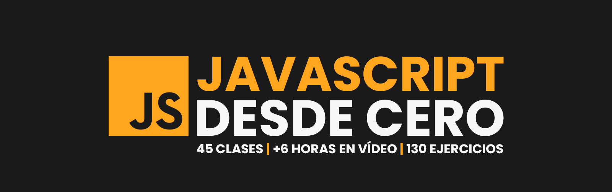

# 👨🏻‍💻 Practicas de JavaScript desde 0 con MoureDev ✨

## 📝 Descripción:

Este proyecto es una iniciativa personal para aprender JavaScript desde cero siguiendo los recursos y contenidos educativos proporcionados por el canal de YouTube MoureDev. A través de este curso, desarrollaré una base sólida en JavaScript, una de las tecnologías más importantes y utilizadas en el desarrollo web.

El aprendizaje estará enfocado en realizar prácticas constantes y resolver numerosos ejercicios prácticos, lo que me permitirá comprender conceptos clave como:

 - Variables, tipos de datos y operadores.
 - Control de flujo (condicionales y bucles).
 - Funciones y manejo de eventos.
 - Manipulación del DOM (Document Object Model).
 - Uso de APIs y promesas.
 - Buenas prácticas de programación en JavaScript.

## 🎯 Objetivo principal 🎯
Adquirir habilidades prácticas en JavaScript para aplicarlas en proyectos personales y profesionales, dominando los fundamentos de esta tecnología esencial.

## ✍🏻 Metodología

1. Seguir los tutoriales y desafíos planteados por MoureDev.
2. Implementar ejercicios de forma individual, reforzando el aprendizaje teórico con la práctica.
3. Documentar cada lección y práctica en un repositorio de GitHub, mostrando mi progreso y resultados.

## 🫱🏻‍🫲🏻 Resultados Esperados 
Al finalizar este proyecto, espero tener un conocimiento sólido de JavaScript y una colección de ejercicios y mini proyectos que demuestren mis habilidades. Esto me preparará para enfrentar nuevos retos en el desarrollo web y me acercará más al mundo profesional del desarrollo de software.

## ⭐ Créditos

Este proyecto se desarrolló siguiendo el contenido educativo y los recursos proporcionados por [MoureDev](https://www.youtube.com/@mouredev), un excelente creador de contenido y desarrollador de software. 

Puedes visitar su canal de YouTube para aprender más sobre desarrollo y programación:  
👉 [MoureDev - Canal de YouTube](https://www.youtube.com/@mouredev)

Además, el curso utilizado como base para este proyecto es:  
📚 [Aprende JavaScript desde Cero](https://youtu.be/1glVfFxj8a4)

¡Gracias a MoureDev por compartir su conocimiento con la comunidad! 😊

